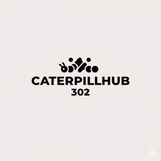

Here is your **fully structured, clean, ready-to-paste `README.md`** with **proper formatting**, **correct code blocks**, **correct section spacing**, and **professional-grade structure**.

---

# ✅ **FINAL README.md (Perfectly Structured)**

### *Copy → Paste → Done*

````md
# 🎉 Wedding Company Quiz App  
### _Interactive quiz built with Next.js, TypeScript, TailwindCSS & Framer Motion_

<p align="center">
  
</p>

---

## 🌟 Overview

This project is a clean, responsive, and interactive **Quiz Application** created for the  
**Wedding Company Assignment**.

It features a polished Figma-accurate UI, animated transitions, a playful mascot,  
and a smooth user experience powered by **Next.js App Router** and **Framer Motion**.

---

## ✨ Features

### 🎨 Beautiful, Modern UI  
- Pixel-perfect replication of the Figma design  
- Soft gradients, rounded card frames, elegant shadows  
- Clean typography using **Geist Font**  
- Fully responsive layout for desktop & mobile

### 🐾 Animated Mascot  
- Cat paw animation using Framer Motion  
- Floating speech bubble with fade-in and scale effects  
- Precisely positioned to match reference design

### ⚡ Smooth Animation System  
- Framer Motion for entrance, exit, and interactive animations  
- GPU-friendly transitions  
- Micro-interactions for enhanced UX

### 🛠️ Clean Architecture  
- Modular, reusable components  
- Next.js App Router structure  
- Tailwind utility-first styling  
- Vercel Analytics integrated

---

## 📸 Screenshots  

```md
[Quiz Screen](./public/readme/quiz-screen.png)
[Results Screen](./public/readme/results-screen.png)
````

---

## 🧩 How the Quiz Works

1. User selects an answer → selection stored in state
2. Progress bar updates based on active question
3. Navigation buttons allow moving back and forth
4. Submit button appears on the final question
5. A score is calculated based on correct answers
6. Results screen appears with a Restart option

---

## 🔧 Installation & Setup

### **Clone the project**

```bash
git clone https://github.com/your-username/wedding-company-quiz.git
cd wedding-company-quiz
```

### **Install dependencies**

```bash
npm install
# or
pnpm install
```

### **Start development server**

```bash
npm run dev
```

Then open:

👉 **[http://localhost:3000](http://localhost:3000)**

---

## 📦 Production Build

```bash
npm run build
npm start
```

---

## 🚀 Deploying to Vercel

```bash
vercel
```

Deployment completes in seconds.

---

## 🔮 Future Enhancements

* API-based dynamic question loading
* Countdown timer mode
* Sound effects for interactions
* Confetti celebration for high scores
* Global leaderboard
* Multi-category quiz modes

---

## 💎 Credits

* Designed per the Wedding Company Assignment specification
* Built using Next.js, TypeScript, TailwindCSS, and Framer Motion
* Includes custom UI polishing & animated mascot